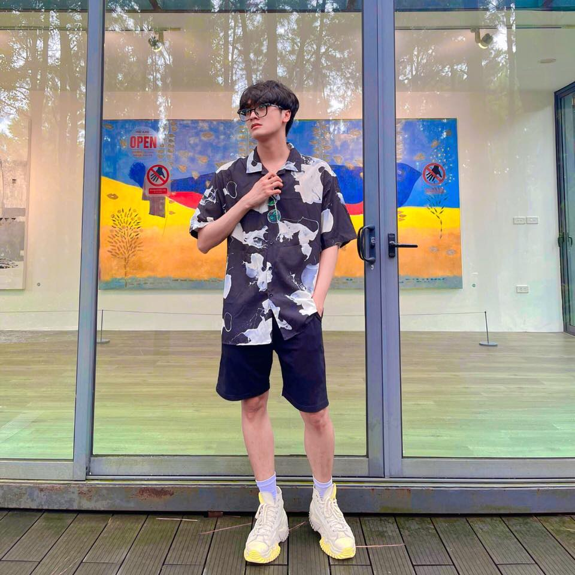

# Xin chào! :wave::smiley: 🐶

<h1> Hi, chào cậu, mình ở đây từ afternoon.</h1>

<h2 align="center">🛠 Technologies and Tools 🛠</h2>
 
<!-- https://simpleicons.org/ -->

&nbsp;

&nbsp;

&nbsp;

&nbsp;

&nbsp;

&nbsp;

&nbsp;

&nbsp;
 
<h2 align="center">🔥 GitHub Stats 🔥</h2>
<!-- https://github.com/anuraghazra/github-readme-stats -->
 

  
  

 
<h2 align="center">🐶 Where to find me 🐶</h2>
 
<!-- https://icons8.com -->

  
 
  
  
  

 
<h2 align="center">📑 My Favorites Quote 📑</h2>
 

